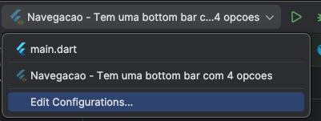
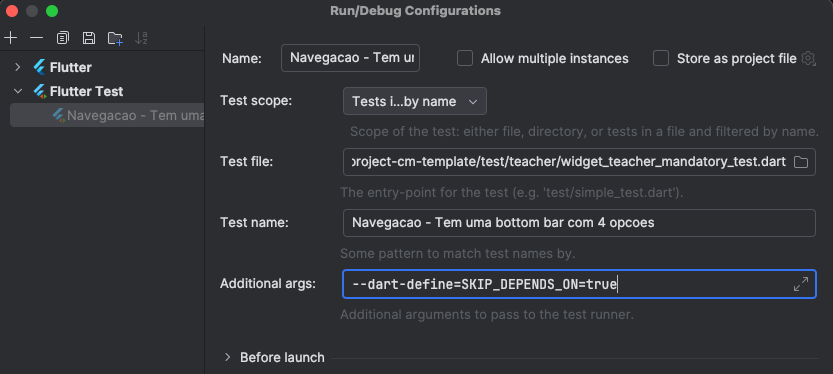

## Execução dos testes

Embora não sendo uma boa prática no desenho de testes, a nível académico faz sentido que alguns testes tenham precedências. Exemplo:
Não faz sentido testar se a submissão do formulário funciona quando o teste que verifica a navegação para esse ecrã falha. Nesse sendido, caso executem os testes através do método `main` (onde todos os testes são executados) esta precedência é verificada dando algumas dicas sobre que teste deverão resolver primeiro.

Se, quiserem executar algum teste sem esta funcionalidade, basta seguirem estes passos:





## AUTHORS.txt

Devem criar um ficheiro na raíz do projeto (ao nível do README.txt) com o nome AUTHORS.txt. Este ficheiro terá o(s) número(s) e nome do(s) aluno(s) separado por ponto e vírgula (;).
Nota: Sem este ficheiro os testes não serão avaliados.

```
a21234567;John Doe
a27654321;Richard Roe
```

## Pressupostos para os testes

Nota: Existem testes que dependem de outros para serem passarem, nestes casos, será apresentada uma mensagem com a indicação dos testes que estão a falhar. Esta dependencia pode ser removida de duas formas:
1. Diretamente no teste, passsando o argumento `skipCheckDependsOn` com o valor `true` na funcão `checkDependsOn`
2. Na implementação da função `checkDependsOn`, o valor por omissão do argumento `skipCheckDependsOn` para `true`

* Existe a classe `Station` com os atributos
```
String id;
String name;
double latitude, longitude;
String lineName;
List<IncidentReport> reports;
```
* Existe a classe `IncidentReport` com os atributos
```
DateTime timestamp;
int rate;
String? notes;
IncidentType type;
```
* Ainda dentro da classe `IncidentReport` existe um enumerado `IncidentType` com os seguintes tipos
```
ESCALATOR
ELEVATOR
TICKET_MACHINE
TURNSTILE
OTHER
```
* Existe a classe `MetroRepository` com a API .... Construtor vazio, não inicializa logo com estação alguma
* O `main()` deve pré-inicializar o `MetroRepository` com 3 estações (podem inventar os id's e dados, pois os testes vão inicializar de outra forma)
* O Provider injeta instância de `MetroRepository`
* Os items da `NavigationBar` têm as seguintes keys:
    * `dashboard-bottom-bar-item`
    * `list-bottom-bar-item`
    * `map-bottom-bar-item`
    * `incidents-report-bottom-bar-item`
* A `ListView` onde são apresentadas as estações tem a key `list-view`
* Todos os ecrãs têm um Widget do tipo `Scaffold` com uma key relacionada com o ecrã em questão:
    * `dashboard-screen`
    * `list-screen`
    * `map-screen`
    * `incidents-report-screen`
* Os campos do formulário para inserir os incidentes têm que ser do tipo `TestableFormField` com as seguintes keys:
    * `incident-station-selection-field`
    * `incident-type-selection-field`
    * `incident-rating-field`
    * `incident-datetime-field`
    * `incident-notes-field`
    * E um Button `incident-form-submit-button`
* Todos os campos do formulário são de preenchimento obrigatório, excepto o campo `incident-notes-field`
* Caso não preenchido, ao submeter o formulário, deverá ser apresentadas indicações de erro para cada campo
* O campo `incident-rating-field` deve aceitar apenas números inteiros entre 1 e 5, caso contrário, deve apresentar uma indicação de erro
    * 'Preencha a estação'
    * 'Preecha o tipo de incidente'
    * 'Preencha a avaliação'
    * 'Preencha a data e hora'
* Sempre que a cor da linha (Vermelha, Azul, etc) for mencionada, deve ser seguida da palavra "Linha".
* Os argumentos dos contrutores devem ser todos named ou seja, não posicionais.
